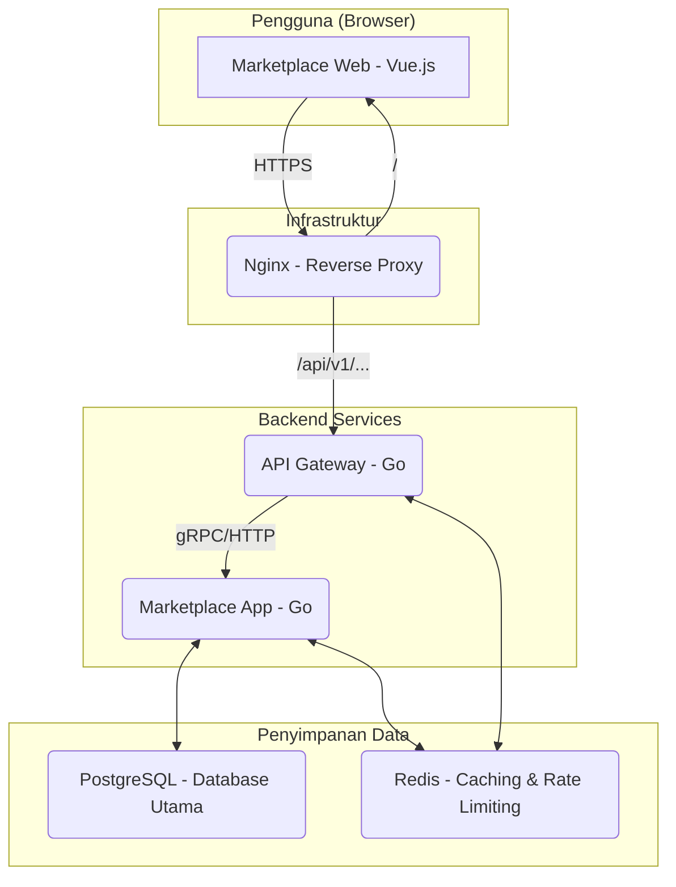

# Go-API Mart: Platform Marketplace API


**Go-API Mart** adalah platform marketplace API *open-source* yang dibangun dengan arsitektur *microservices*. Platform ini memungkinkan developer untuk mempublikasikan, mengelola, dan memonetisasi API mereka, sementara konsumen dapat dengan mudah menemukan, berlangganan, dan menggunakan berbagai API dalam satu tempat terpusat.

## Arsitektur

Proyek ini mengadopsi arsitektur berbasis *microservices* untuk memastikan skalabilitas, pemeliharaan, dan pemisahan tugas yang jelas.



-   **Marketplace Web (Vue.js)**: *Single-Page Application* (SPA) yang menjadi antarmuka utama bagi semua pengguna (konsumen, provider, admin).
-   **Nginx**: Berfungsi sebagai *reverse proxy* yang mengarahkan trafik masuk ke layanan frontend atau backend yang sesuai.
-   **API Gateway (Go)**: Pintu gerbang utama untuk semua permintaan API. Bertugas untuk otentikasi (validasi JWT), *rate limiting*, dan *routing* ke layanan internal.
-   **Marketplace App (Go)**: Layanan utama yang menangani semua logika bisnis, termasuk manajemen pengguna, pendaftaran API, langganan, penagihan, dan dompet digital.
-   **PostgreSQL**: Database relasional untuk menyimpan semua data persisten seperti pengguna, API, transaksi, dll.
-   **Redis**: Digunakan untuk *caching* data sesi, dan implementasi *rate limiting*.

## Fitur Utama

-   **Manajemen Pengguna & Otentikasi**: Registrasi, login, dan manajemen profil dengan otentikasi aman menggunakan JWT (berbasis ECDSA).
-   **Dasbor Terpisah**: Dasbor khusus untuk **Konsumen** (mengelola langganan & kunci API), **Provider** (mengelola API & melihat pendapatan), dan **Admin** (mengelola platform).
-   **Publikasi API**: Provider dapat mendaftarkan API mereka, menentukan *endpoint*, dan mengatur harga per panggilan.
-   **Sistem Langganan & Kunci API**: Konsumen dapat berlangganan API dan membuat kunci API unik untuk setiap langganan.
-   **Sistem Dompet & Penagihan**: Pengguna dapat mengisi saldo (top-up) dan saldo akan otomatis terpotong setiap kali ada pemanggilan API.
-   **Rate Limiting**: Melindungi API dari penyalahgunaan dengan membatasi jumlah permintaan per periode waktu.
-   **Siap Produksi dengan Docker**: Seluruh platform dikemas dalam kontainer untuk kemudahan deployment dan skalabilitas.

## Teknologi yang Digunakan

-   **Backend**: Go
-   **Frontend**: Vue.js 3 (Vite), Pinia, TailwindCSS
-   **Database**: PostgreSQL (penyimpanan utama), Redis (caching, rate limiting)
-   **Reverse Proxy**: Nginx
-   **Containerization**: Docker & Docker Compose

## Struktur Proyek

```
.
├── api-gateway/         # Layanan API Gateway (Go)
├── marketplace-app/     # Layanan Backend Utama (Go)
├── marketplace-web/     # Aplikasi Frontend (Vue.js)
├── nginx/               # Konfigurasi Nginx (dev & prod)
├── shared/              # Pustaka bersama untuk backend (model, JWT, dll.)
├── project-docs/        # Dokumentasi proyek
├── secrets/             # Kunci ECDSA untuk JWT
├── docker-compose.yml   # Orkestrasi Docker untuk development
├── docker-compose.prod.yml # Orkestrasi Docker untuk production
└── makefile             # Perintah-perintah untuk mempermudah development
```

## Memulai Proyek

### Prasyarat

-   [Go](https://golang.org/dl/) (v1.24+ direkomendasikan)
-   [Node.js](https://nodejs.org/) (v18+ direkomendasikan)
-   [Docker](https://www.docker.com/) & [Docker Compose](https://docs.docker.com/compose/)
-   [Make](https://www.gnu.org/software/make/) (opsional, untuk kemudahan)

### Instalasi

1.  **Clone repository:**
    ```sh
    git clone https://github.com/ZXstrike/api-marketplace.git
    cd api-marketplace
    ```

2.  **Konfigurasi Environment:**
    Salin file `.env.example` menjadi `.env`. Tidak perlu ada perubahan untuk menjalankan di mode development.
    ```sh
    cp .env.example .env
    ```

3.  **Buat Kunci JWT:**
    Jalankan perintah ini untuk membuat pasangan kunci `private_key.pem` dan `public_key.pem` di dalam folder `secrets/`.
    ```sh
    make gen-keys
    ```

4.  **Jalankan dengan Docker Compose (Direkomendasikan):**
    Perintah ini akan membangun *image* dan menjalankan semua layanan yang dibutuhkan (Postgres & Redis).
    ```sh
    docker-compose up -d
    ```

5.  **Jalankan Layanan Backend:**
    Buka dua terminal terpisah dan jalankan:
    ```sh
    # Terminal 1: Jalankan Marketplace App
    make run-market

    # Terminal 2: Jalankan API Gateway
    make run-gateway
    ```

6.  **Jalankan Layanan Frontend:**
    Buka terminal ketiga untuk menjalankan aplikasi Vue.js.
    ```sh
    cd marketplace-web
    npm install
    npm run dev
    ```

7.  **Selesai!**
    Platform sekarang dapat diakses di:
    -   **Frontend**: `http://localhost:5173`
    -   **API Gateway**: `http://localhost:8082` (sesuai `.env`)
    -   **Marketplace App**: `http://localhost:8081` (sesuai `.env`)

## Dokumentasi API

Dokumentasi lengkap untuk semua *endpoint* REST API tersedia di file [project-docs/endpoint_new.md](project-docs/endpoint_new.md).

## Lisensi

Proyek ini dibuat untuk tujuan edukasi dan portofolio.
